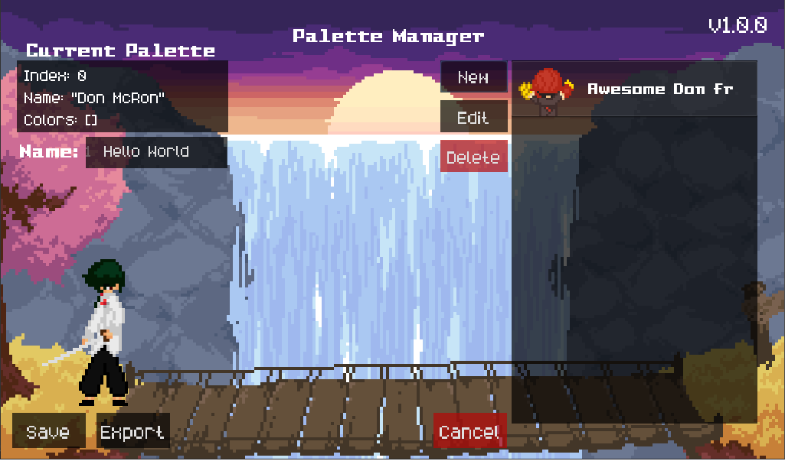

<h2 align="center">
    Hyperfight Palette Editor
</h2>

    A graphical solution for creating and managing palettes for HYPERFIGHT.

    

## Installation
Please see the [itch.io page](https://tokorv.itch.io/hyperfight-palette-editor) to install.
